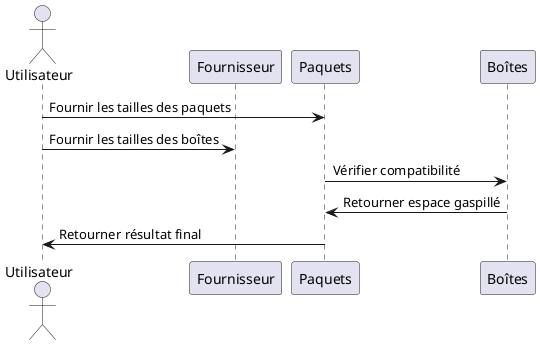

# Résoudre le Mystère des Paquets et des Boîtes : Une Approche Pédagogique

## Introduction au Problème

Imaginez-vous plongé dans une énigme complexe où chaque détail compte. 
Vous avez devant vous \( n \) paquets de tailles variées, et votre mission est de les placer dans des boîtes fournies par l'un des \( m \) fournisseurs. 
Chaque fournisseur possède un nombre illimité de boîtes, chacune de tailles différentes. 
La règle est simple : un paquet peut entrer dans une boîte seulement si sa taille n'excède pas celle de la boîte. 
Votre objectif est de minimiser l'espace gaspillé total, c'est-à-dire la somme des différences entre les tailles des boîtes et celles des paquets qu'elles contiennent.

### Illustration du Problème

Prenons un exemple pour illustrer la situation : vous avez des paquets de tailles `[2, 3, 5]` et un fournisseur propose des boîtes de tailles `[4, 8]`. Ici, l'espace gaspillé minimal est de 6. Comment ? En plaçant les paquets de la manière suivante :
- Le paquet de taille 2 dans une boîte de taille 4.
- Le paquet de taille 3 dans une boîte de taille 4.
- Le paquet de taille 5 dans une boîte de taille 8.

### Défi

Si vous ne pouvez pas faire rentrer tous les paquets dans les boîtes, vous devez retourner -1. Sinon, vous calculez l'espace gaspillé total et vous le retournez modulo \( 10^9 + 7 \) pour maintenir le résultat dans une plage raisonnable même pour de très grands nombres.

## Intuition et Approche de la Solution

Pour résoudre cette énigme, nous devons utiliser deux outils principaux : le tri et la recherche binaire.

### Étape 1 : Vérification de la Plus Grande Boîte

Pour que tous les paquets rentrent dans les boîtes d'un fournisseur, la plus grande boîte doit être au moins aussi grande que le plus grand paquet. Si ce critère est respecté, nous pouvons alors passer au calcul de l'espace gaspillé total en utilisant les boîtes de ce fournisseur.

### Étape 2 : Tri des Paquets et des Boîtes

Nous devons aligner nos suspects – les paquets et les boîtes – par ordre croissant. Pourquoi ? Parce que cela simplifie notre recherche de la plus petite boîte qui peut contenir chaque paquet. Pour cela, nous utilisons une méthode rapide et efficace : la recherche binaire.

### Étape 3 : Placement des Paquets

Pour chaque fournisseur, nous allons procéder de la manière suivante :
1. Trier les tailles de boîtes.
2. Vérifier si la plus grande boîte peut contenir le plus grand paquet.
3. Initialiser les variables pour l'espace gaspillé cumulé (s) et l'index actuel des paquets (i).
4. Placer chaque paquet dans la boîte la plus petite possible qui peut le contenir.
5. Calculer et mettre à jour l'espace gaspillé total.
6. Comparer cet espace gaspillé avec la meilleure solution trouvée jusqu'à présent.

### Exemple de Code

Voici un pseudocode pour mieux illustrer l'approche :

```
CONST INF = Long.MAX_VALUE
CONST MOD = 10^9 + 7

FONCTION minEspaceGaspille(paquets, boites)
    TRIER paquets
    espacePerduMin = INF

    POUR CHAQUE boite DANS boites FAIRE
        TRIER boite
        SI peutAccommoderTousLesPaquets(paquets, boite) ALORS
            espacePerduActuel = calculerEspacePerdu(paquets, boite)
            espacePerduMin = MIN(espacePerduMin, espacePerduActuel)
        FIN SI
    FIN POUR

    SI espacePerduMin == INF ALORS
        RETOURNER -1
    FIN SI

    tailleTotalePaquets = calculerTailleTotalePaquets(paquets)
    RETOURNER (espacePerduMin - tailleTotalePaquets) % MOD
FIN FONCTION

FONCTION peutAccommoderTousLesPaquets(paquets, boite)
    RETOURNER paquets[LONGUEUR(paquets) - 1] <= boite[LONGUEUR(boite) - 1]
FIN FONCTION

FONCTION calculerEspacePerdu(paquets, boite)
    espacePerduActuel = 0
    indexDebut = 0

    POUR CHAQUE taille DANS boite FAIRE
        indexFin = borneSuperieure(paquets, taille, indexDebut)
        espacePerduActuel += (indexFin - indexDebut) * taille
        indexDebut = indexFin
    FIN POUR

    RETOURNER espacePerduActuel
FIN FONCTION

FONCTION calculerTailleTotalePaquets(paquets)
    tailleTotalePaquets = 0

    POUR CHAQUE paquet DANS paquets FAIRE
        tailleTotalePaquets += paquet
    FIN POUR

    RETOURNER tailleTotalePaquets
FIN FONCTION

FONCTION borneSuperieure(nums, cible, gauche)
    droite = LONGUEUR(nums)
    TANT QUE gauche < droite FAIRE
        milieu = gauche + (droite - gauche) / 2
        SI nums[milieu] > cible ALORS
            droite = milieu
        SINON
            gauche = milieu + 1
        FIN SI
    FIN TANT QUE

    RETOURNER gauche
FIN FONCTION

```

### Schéma UML

Pour mieux visualiser cette logique, voici un diagramme UML simplifié :



## Conclusion

Cette approche méthodique réduit efficacement le nombre de fournisseurs à examiner et calcule l'espace gaspillé sans vérifications ou itérations inutiles, optimisant ainsi le processus. Chaque détail compte dans cette enquête, et chaque choix est crucial pour résoudre le mystère de l'espace gaspillé.